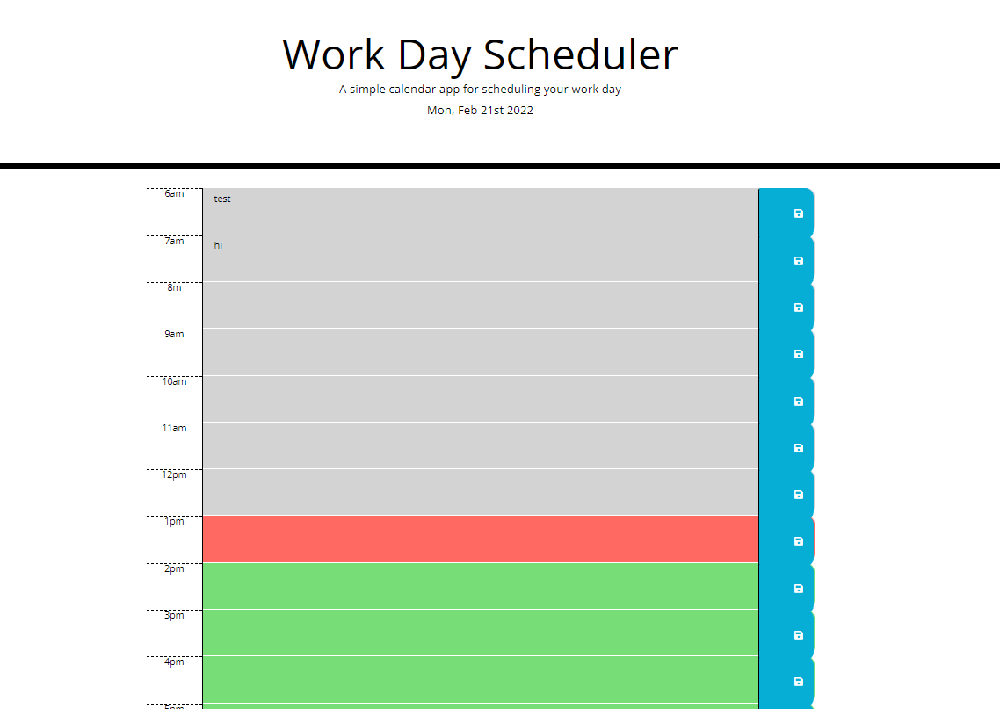

Much of the styles and lay out were pre-determined with code provided through the styles.css file provided. Background fields change based on the time of day as well as accurate time keeping due to the moment api included with this project. The save function saves the text into local storage.

[Link to final project webpage](https://confusedicarus.github.io/05-daily-work-scheduler/)
